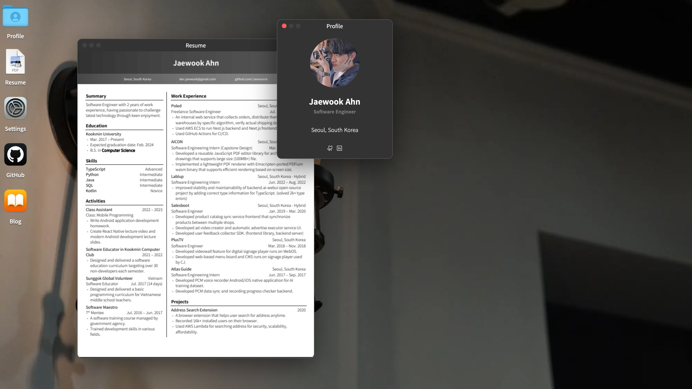

<h1 align="center">Jaewook's Portfolio Web</h1>

My portfolio website built on Next.js.

    <a href="https://portfolio.jaewook.me">Visit Website</a>
    &middot;
    

## Author

- [Jaewook Ahn](https://github.com/Jaewoook)

## License

This project is licensed under the [MIT License](./LICENSE).
